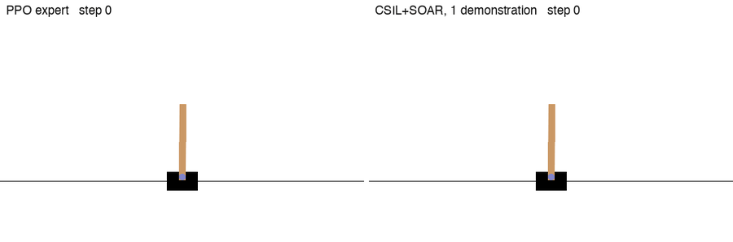

# CSIL and IL-SOAR — imitation learning benchmark

EE-568 Reinforcement Learning project (Amir Lahlou, EPFL).
Reimplementation of CSIL and IL-SOAR following the original papers, benchmarked across expert-demonstration budgets on Gymnasium control tasks. This repository contains the CSIL + IL-SOAR portion of the joint course report.

## Contents

```
report.pdf              — the 4-page submission
report.tex              — LaTeX source
README.md               — this file

benchmark_csil.py       — multi-seed multi-K bench (CSIL and CSIL+SOAR)
plot_final.py           — per-algorithm training curves
plot_compare_algos.py   — CSIL vs CSIL+SOAR cummax compare panel
train_expert.py         — PPO expert trainer
requirements.txt        — pip deps

imitation_policies/
  imitation_policy.py   — abstract ImitationPolicyAgent + Transition
  utils.py              — MLP, ReplayBuffer, polyak_update
  csil.py               — CSILAgent (Algorithm 1 critic + Algorithm 2 actor refinement)
  csil_soar.py          — CSILSOARAgent (twin ensemble + UCB optimistic Q)

ppo_acrobotv1.zip       — trained PPO expert (5M env steps, return -61.8 +/- 0.7)
ppo_cartpolev1.zip      — trained PPO expert (200k env steps, return 500/500)

plots/
  acrobot_csil_mean.png            — Fig. 1a in report
  acrobot_csilsoar_mean.png        — Fig. 1b in report
  acrobot_compare_q25cummax.png    — Fig. 2 in report

media/
  render_rollouts.py               — side-by-side rollout videos, expert vs CSIL+SOAR
  cartpole_expert_vs_csil_soar.gif / .mp4
  acrobot_expert_vs_csil_soar.gif / .mp4

checkpoints/
  csil_soar_CartPole-v1_K1_actor.pt   — actor trained from 1 expert demonstration (return 500/500)
  csil_soar_Acrobot-v1_K50_actor.pt   — actor trained from 50 expert demonstrations (return about -66)

data/
  benchmark_csil_Acrobot-v1.csv         — final (seed, K) Q25 snapshots, CSIL
  benchmark_csil_soar_Acrobot-v1.csv    — final (seed, K) Q25 snapshots, CSIL+SOAR
  curves_6000eps_snapshot.csv           — per-iter eval (mean, Q25) for both algos
```

## Reproduce the benchmark

Python 3.11 required (categorical match/case used in some pipelines).

```bash
python3 -m venv .venv
source .venv/bin/activate
pip install -r requirements.txt
```

Re-run the Acrobot bench used in the report (3 seeds x K in {20,50,100},
480k env steps per run; ~3-4 h on CPU):

```bash
python3 benchmark_csil.py --env Acrobot-v1 --algo csil \
    --seeds 0 1 2 --Ks 20 50 100 \
    --n_iters_c 480 --learner_steps 1000 --n_grad_steps_per_iter 16 \
    --curves_csv data/curves_6000eps_snapshot.csv

python3 benchmark_csil.py --env Acrobot-v1 --algo csil_soar \
    --seeds 0 1 2 --Ks 20 50 100 \
    --n_iters_c 480 --learner_steps 1000 --n_grad_steps_per_iter 16 \
    --curves_csv data/curves_6000eps_snapshot.csv
```

## Regenerate the figures

```bash
python3 plot_final.py --csv data/curves_6000eps_snapshot.csv --outdir plots/
python3 plot_compare_algos.py --csv data/curves_6000eps_snapshot.csv \
    --out plots/acrobot_compare_q25cummax.png
```

## Rollout videos

PPO expert on the left, CSIL+SOAR policy on the right, same evaluation seed:




```bash
python3 media/render_rollouts.py
```

## Rebuild the PDF

```bash
pdflatex report.tex
pdflatex report.tex   # second pass for cross-refs
```

## Re-train the experts (optional, slow)

```bash
python3 train_expert.py            # writes ppo_cartpolev1.zip and ppo_acrobotv1.zip
```

## Reference table (Q25 at best snapshot, mean +/- ddof=1 std over 3 seeds)

PPO expert reference on Acrobot-v1: -61.8 +/- 0.7

|              | K=20            | K=50            | K=100           |
|--------------|-----------------|-----------------|-----------------|
| BC (CSIL run)| -89.3 +/- 6.9   | -93.8 +/- 0.6   | -93.2 +/- 1.5   |
| CSIL         | -85.0 +/- 3.2   | -82.0 +/- 6.6   | -85.2 +/- 2.4   |
| BC (SOAR run)| -86.5 +/- 6.7   | -85.8 +/- 4.4   | -91.8 +/- 1.2   |
| CSIL+SOAR    | -85.3 +/- 8.5   | -80.2 +/- 7.1   | -83.6 +/- 4.6   |

All numbers reproduce from the CSVs in `data/` to +/- 0.1.

## Papers

- Watson, Huang, Heess. *Coherent Soft Imitation Learning*. NeurIPS 2023. arXiv:2305.16498
- Viel, Viano, Cevher. *IL-SOAR: Imitation Learning with Soft Optimistic Actor cRitic*. arXiv:2502.19859, 2025
